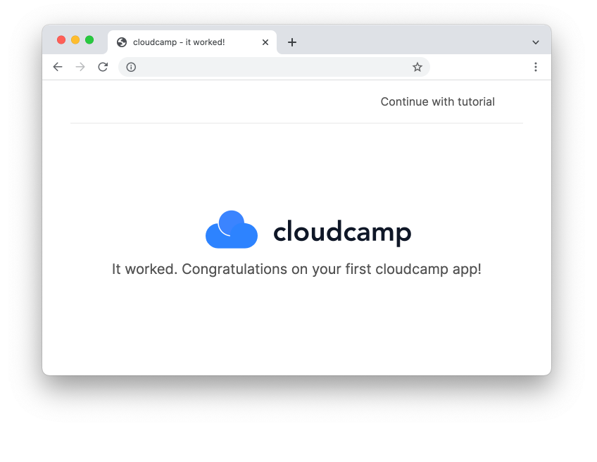
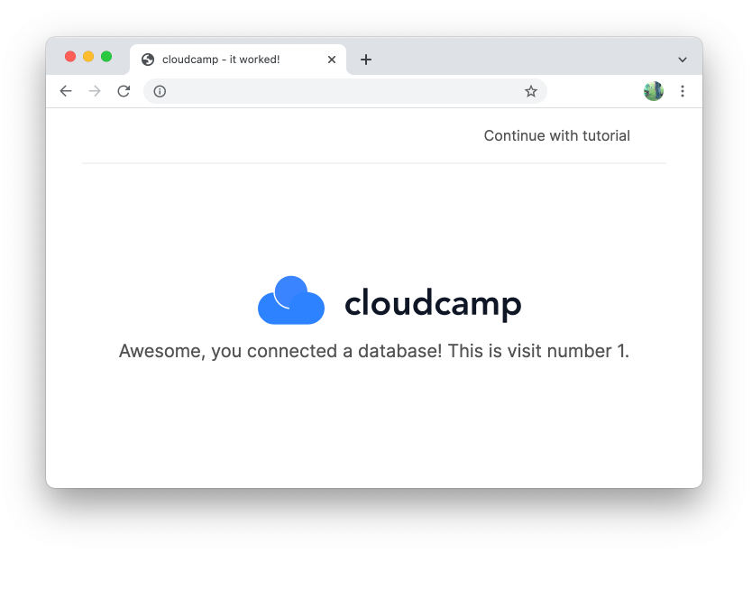

This tutorial will show you how to build and deploy an application with
cloudcamp.

Once you have learned the basics, you will be able to set up any cloud
application way faster than by hand or using configuration files. You will learn
how to automate all aspects of your app in surprisingly few lines of code -
while still having the full flexibility of AWS at your fingertips.

Make sure that [cloudcamp is
installed](/docs/installation/#installing-cloudcamp) and your [AWS account is
configured](/docs/installation/#aws-setup).

<div class="p-5 bg-gray-50 text-sm px-10 border-l-4 border-blue-500 relative">
<div class="text-white bg-blue-500 w-5 h-5 text-center font-bold absolute" style="left:-4px; top:0px;">i</div>
The resources you create in this tutorial are covered by the AWS free
tier. When you are done, you can tear down all resources with <a
href="#cleaning-up">a single command</a>, leaving your AWS account in a
clean state.
</div>

# The source repository

To learn the basics of cloudcamp, we will deploy a simple web application. Fork
the <a href="https://github.com/cloudcamphq/tutorial" target="_blank">tutorial
repository on GitHub</a>, then clone it:

```bash
$ git clone git@github.com:YOUR-USERNAME/tutorial.git
```

Next, change directory and checkout the branch for your language:

<div class="gatsby-highlight" data-language="ts">
  <pre class="ts language-ts"><code class="ts language-ts">$ cd tutorial
$ git checkout typescript</code></pre>
</div>
<div class="gatsby-highlight" data-language="javascript">
  <pre class="javascript language-javascript"><code class="javascript language-javascript">$ cd tutorial
$ git checkout javascript</code></pre>
</div>
<div class="gatsby-highlight" data-language="python">
  <pre class="python language-python"><code class="python language-python">$ cd tutorial
$ git checkout python</code></pre>
</div>
<div class="gatsby-highlight" data-language="csharp">
  <pre class="csharp language-csharp"><code class="csharp language-csharp">$ cd tutorial
$ git checkout csharp</code></pre>
</div>
<div class="gatsby-highlight" data-language="java">
  <pre class="java language-java"><code class="java language-java">$ cd tutorial
$ git checkout java</code></pre>
</div>

# Creating an app

Cloudcamp organizes your deployments into "apps" - lightweight
infrastructure-as-code programs that live in your project alongside the rest of
your application code.

Run `camp init` to create one:

```bash
$ camp init
```

Set the language to <code class="language-text"
data-language="ts">TypeScript</code><code class="language-text"
data-language="javascript">JavaScript</code><code class="language-text"
data-language="python">Python</code><code class="language-text"
data-language="java">Java</code><code class="language-text"
data-language="csharp">C#</code> and select `Continue`.

You now have a new directory called `cloudcamp` in the root of the project that
contains your new app at `cloudcamp/tutorial`.

Let's change directory:

```bash
$ cd cloudcamp/tutorial
```

# Deploying to AWS

Now can run deploy:

```bash
$ camp deploy
```

Select `Continue` and follow the on screen instructions. This will connect your
GitHub account and store the access token in your AWS account, so that pushing
to your repository can update your application.

When the deploy command has completed, the build process will start.

Run `camp status` to watch the progress:

```bash
$ camp status --wait --notify

Deployment Status:   ✔ Deployed
Build Status:        ✔ Succeeded...
Git commit URL:      https://github.com/mme/tutorial/commit/b38a08f9e5c897d96d1c3bb2ec7d97c8e1afb05a

Outputs:

Stack              ID            Type          Value
────────────────── ───────────── ───────────── ──────────────────────────────────────────────────────────────────────
TutorialProduction productionweb WebServer URL http://Cloud-tutor-1WOJ5XGFE5KAP-751011628.us-east-1.elb.amazonaws.com
```

Once finished, status will print the the URL of our web server. Copy and paste the
URL in your browser to verify everything is working:



🎉 **Congratulations!** In a few minutes, you created:

- a build pipeline that deploys your app on a single `git push`.

- a load balanced, containerized web server capable of scaling to a large number of machines.

Let's take a look at what we just created.

# Infrastructure as Code

Cloudcamp is based on _Amazon Cloud Development Kit (CDK), a declarative way of
building infrastructure_. This means that instead of imperatively creating and
updating resources, we define a model of what our infrastructure should look
like. CDK then takes care of making the necessary changes to accomplish our
desired state.

Open up <code class="language-text" data-language="ts">src/camp.ts</code><code class="language-text" data-language="javascript">src/camp.js</code><code class="language-text" data-language="python">src/camp.py</code><code class="language-text" data-language="java">src/Camp.java</code><code class="language-text" data-language="csharp">src/Camp.cs</code> in your camp's directory and take a look.

```ts
import { App, WebServer } from "@cloudcamp/aws-runtime";

let app = new App();

new WebServer(app.production, "web", {
  dockerfile: "../../Dockerfile",
  port: 3000,
});
```

In the beginning of every program, we instantiate the class `App` which stands
for an instance of our application running in the cloud.

Next, we create a new `WebServer`, by passing in the parent stack
`app.production` and an identifier `"web"`. Finally, we pass a Dockerfile and a
port so our web server knows what to run.

<div class="p-5 bg-gray-50 text-sm px-10 border-l-4 border-blue-500 relative">
<div class="text-white bg-blue-500 w-5 h-5 text-center font-bold absolute" style="left:-4px; top:0px;">i</div>
<code class="language-text">App</code> organizes our resources into groups called <code class="language-text">Stacks</code> that get built and
deployed together. Here we make use of a default stack called <code class="language-text">app.production</code>.
<br/><br/>
By providing a parent and an identifier when creating a resource, CDK can keep track of our infrastructure and knows when to create new resources or update existing ones.
</div>

# Adding a database

To add a PostgreSQL database, make the following changes to this source code:

```ts
import { App, WebServer, Database } from "@cloudcamp/aws-runtime";
let app = new App();

// ⬇ 1) add a postgres database to the production stack
let productionDb = new Database(app.production, "db", {
  engine: "postgres",
});

new WebServer(app.production, "web", {
  dockerfile: "../../Dockerfile",
  port: 3000,
  // ⬇ 2) add the database url to the environment variables of our webserver
  environment: { DATABASE_URL: productionDb.databaseUrl },
});
```

Here we create a database and add it to the production stack.
Then we let the web server know about the database by adding the environment
variable `DATABASE_URL`.

Push the code to apply this change and wait for the pipeline to complete:

```bash
$ git add -A && git commit -m "add database" && git push
$ camp status --wait --notify
```

When refreshing our app in the browser we can see that it is now connected to
the database.



# Setting up monitoring

In a production app, we need to know when things goes wrong - for example, when
users encounter a server error. To simulate an error, visit the `/error` path on
your webserver. Now wouldn't it be nice if we got a notification whenever there
is an error? The `WebServer` class provides an API for exactly that.

Here's how to update your code to add error notifications:

```ts
import { App, WebServer, Database } from "@cloudcamp/aws-runtime";

let app = new App();

let productionDb = new Database(app.production, "db", {
  engine: "postgres",
});

// ⬇ assign our WebServer to a variable
let productionWeb = new WebServer(app.production, "web", {
  dockerfile: "../../Dockerfile",
  port: 3000,
  environment: { DATABASE_URL: productionDb.databaseUrl },
});

// ⬇ set up email notifications when there is an application error
productionWeb.addAlarms({
  email: ["youremail@example.com"],
});
```

Now update the app - you know the drill.

```bash
$ git add -A && git commit -m "add monitoring" && git push
$ camp status --wait --notify
```

Visit `/error` again, and you will get an email notification that something went
wrong. Neat.

# Custom domain (Optional)

Domains and certificates have to be added via the command line before being used. Use
`domain:create` to set up a domain:

```bash
$ camp domain:create yourdomain.com

 Nameservers
 ───────────────────────
 ns-1320.awsdns-37.org
 ns-999.awsdns-60.net
 ns-1838.awsdns-37.co.uk
 ns-72.awsdns-09.com

 › To request a certificate, run `camp cert:create yourdomain.com`

Domain created: yourdomain.com
```

Now change the settings of your domain to point to the nameservers in the
command output.

Once this is done, you can request a certificate.

(Note that this might take a couple of minutes to complete):

```bash
$ camp cert:create yourdomain.com

Creating new certificate... done
Waiting for certificate validation... done
Certificate created: yourdomain.com
```

Finally, update the source code:

```ts
void 0;
import { App, WebServer, Database } from "@cloudcamp/aws-runtime";

let app = new App();

let productionDb = new Database(app.production, "db", {
  engine: "postgres",
});
void "show";

let productionWeb = new WebServer(app.production, "web", {
  // ⬇ add your domain
  domains: ["yourdomain.com"],
  // ⬇ enable https
  ssl: true,
  // ⬇ redirect http to https
  redirectHttp: true,
  // ...
  dockerfile: "../../Dockerfile",
  port: 3000,
  environment: { DATABASE_URL: productionDb.databaseUrl },
});
```

And push your changes:

```bash
$ git add -A && git commit -m "add custom domain" && git push
$ camp status --wait --notify
```

Now, your app will be running under your custom domain.

# Cleaning up

To delete all resources we created during this tutorial, run `destroy` in your camps directory:

```bash
$ camp destroy
```

Cloudcamp will list and upon confirmation destroy all the resources you created.

If you added a custom domain, use this command to delete the DNS zone:

```bash
$ camp domain:delete yourdomain.com
```
